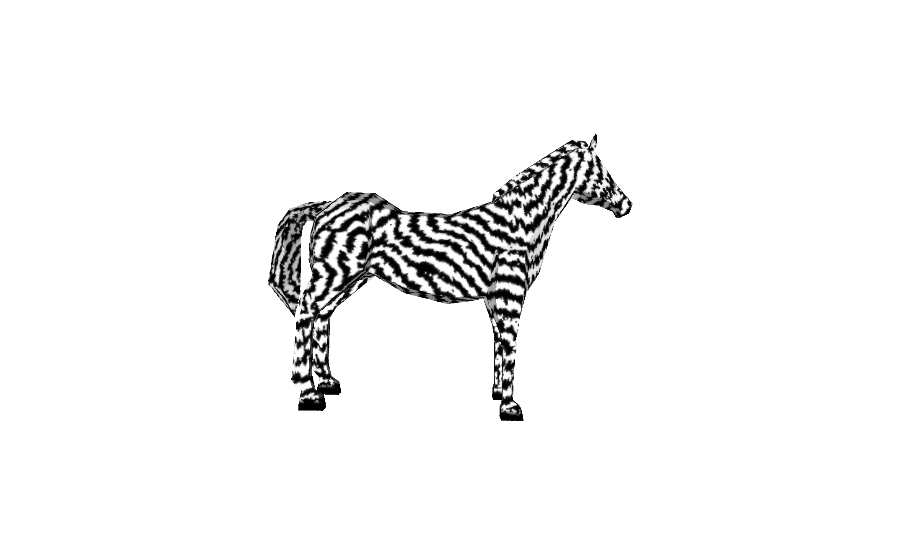

# Reaction Diffusion Texturing
Modelling reaction-diffusion processes with cellular automata to generate textures, inspired from Greg Turks implementation. This implementation utilises Meinhardt's 5 Chemical Stripe Formation Model:

